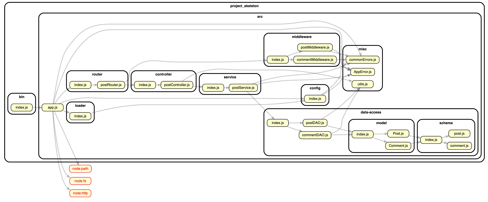

# 엘리스 SW 트랙 1차 프로젝트용 스켈레톤

작성자: 한인호

## 목적

본 프로젝트 구조는 레이서들이 백엔드 서버 어플리케이션 개발을 용이하게 진행할 수 있도록 만들어진 것입니다. 본 구조를 사용하면 전체적인 구성에 대한 이해가 없어도 '어디에 어느 코드를 작성하면 작동하는구나'라는 느낌으로만 프로젝트를 빠르게 개발할 수 있지만 그러한 접근 방식은 본인 학습에 하등 도움이 되지 않으니 프로젝트 전 또는 후에 반드시 코드 내용을 숙지하시길 바랍니다(프론트/백엔드 관계 없이 모두). 레이서분들의 프로젝트 완성과 미래를 응원합니다.

## 목차

- [개요](#개요)
- [프로젝트 구조 설명](#프로젝트-구조-설명)
- [코드 실행](#코드-실행)
- [API 명세 문서](#api-명세-문서)
- [추가해볼만한 것들](#추가해볼만한-것들)
- [뷰 엔진 설정](#뷰-엔진-설정)

## 개요

본 프로젝트 구조는 REST API 서버 어플리케이션을 고려한 구조입니다. 오늘날 웹 상에 배포된 수 많은 서버 어플리케이션이 REST API 서버이며 REST API는 웹 서비스(서버 어플리케이션, 클라이언트 어플리케이션) 간 소통을 위해 사용하는 Layer 7(OSI 7계층)의 HTTP 프로토콜 상에서 운용되는 API(Application Programming Interface)입니다. HTTP의 method, header, query parameter, statud code, idempotecny 등의 본질을 최대한 활용해서 API를 구성하는 것이 특징입니다.

또한 REST API의 URL(endpoint라고도 말함)은 리소스(서비스에서 제공하고자 하는 데이터) 중심적으로 구성하여 사용자로 하여금 URL이 어떤 리소스를 제공하는지를 파악하기 쉽도록 해줍니다. 특히 URL과 HTTP method를 조합하여 해당 URL이 가리키는 리소스에 어떤 액션(Create/Update/Read/Delete)을 취할 것인지를 표현할 수 있다는 강점이 있습니다. 가령 `https://www.example.com/api/v1/posts`라는 URL이 REST API로 제공되어 있다면 해당 API의 리소스는 posts(게시물)이 되겠고 이 URL에 HTTP 요청을 보낼 때 HTTP GET method를 사용하면 게시물 목록을 요청하는 것이되고 HTTP POST method를 사용하면 게시물 생성 요청하는 것이 됩니다.

하지만 기본적으로 URL을 리소스(명사) 중심적으로 구성해야하기 때문에 행위(동사)를 제공하기 위한 URL을 구성하기엔 상대적으로 어려움이 있을 수 있습니다. 이러한 경우 행위 자체를 리소스라고 가정하고 URL을 구성하면 REST API에서 요구하는 URL 조건을 우회해서 만족시킬 수 있습니다. 예를 들어 언어 번역을 위한 API는 다음과 같은 URL로 구성을 할 수 있습니다: `POST https://www.translater.com/api/v1/translation`. POST 요청은 번역 요청을 하는 API(리소스적으로 해석을 하면 '번역 작업' 생성)이며 GET 요청은 번역이 끝난 결과물을 가져오는 API(리소스적으로 해석을 하면 '번역 작업')가 되겠습니다. 즉, 번역이라는 동사가 아니라 '번역 작업'을 리소스로 다루면 충분히 REST API로 제공할 수 있다는 것입니다.

마지막으로 REST API는 API 구조를 작성하는 설계 방식일 뿐 반드시 지켜야하는 법칙(rule)이 아니기 때문에 설계자 및 개발자가 책임감을 가지고 설계 및 개발을 해야합니다.

## 프로젝트 구조 설명

- **bin**: 어플리케이션 시작 코드(index.js)가 있는 경로. 프로젝트 루트 경로에서 node bin/index.js를 실행시키면 서버 어플리케이션이 구동 됩니다. 시작 코드를 구분하는 이유는 서버 어플리케이션 코드(src/app.js)에 어플리케이션 시작 코드를 포함하게 되면 통합 테스트과 같은 테스트를 진행하기 어렵기 때문입니다. 예를 들자면 신규 자동차의 기능 테스트 해봐야하는데 자동차 안에 고정 운전자(app.js에 시작 코드를 다 넣은 격)가 타고 있으면 테스트가 어려워지는 것과 비슷합니다. 제대로 테스트를 하려면 테스트를 전문으로 하는 사람들이 운전자가 되어 차에 탑승해서 진행해야하는데 고정 운전자가 타고 있어서 어려워진 것이죠.
- **src**: bin/index.js를 제외한 모든 어플리케이션 코드가 존재하는 곳.
- **.env.sample**: 어플리케이션 실행 시 필요한 설정값들 중 보안적인 요인 때문에 소스 코드에 기록(하드 코딩)이 되면 안되는 값(이하 시크릿)들을 보통 환경 변수를 통해 입력을 받습니다. 이는 다르게 말하면 어플리케이션 입장에서 실행 시 외부로부터 값을 주입을 받는다는 것이죠. 다만 환경 변수는 CLI에서 export라는 명령어를 사용해서 (개발자가 어플리케이션 실행을 하는 세션) 생성을 해야하는데 이 부분이 생각보다 번거롭습니다. shell script를 작성해도 되지만 해당 스크립트를 어플리케이션 실행 전에 실행을 해줘야하는 부분도 번거롭죠. 그래서 차라리 어플리케이션 실행 시에 이러한 환경 변수 설정 작업이 알아서 되면 안되나라는 생각에 dotenv라는 패키지가 나온 것입니다. 이 패키지는 `.env`라는 파일에 환경 변수를 정의해 놓으면 해당 파일을 읽어서 어플리케이션 내에서 환경 변수를 손쉽게 참조/사용(process.env.<환경변수명> 형태로)을 할 수 있게 해줍니다. 문제는 이 .env 파일에 시크릿 값들이 담겨져 있기 때문에 git 저장소에 올리면 안된다는 것(저장소에 올려버리면 소스 코드에 시크릿값을 기입하는 거랑 다른게 없다)입니다. 그렇기 때문에 이 파일을 git 저장소에는 업로드를 하면 안됩니다. 다만 이 조건 때문에 프로젝트에 새롭게 참여한 팀원들이 현재 프로젝트가 어떠한 환경 변수를 사용하고 있는 지 알 수가 없다는 문제와 새롭게 환경 변수를 추가 했을 때 다른 팀원들이 이를 파악하지 못할 수도 있다는 문제들이 발생하는데 이를 위해서 작성하는 것이 `.env.sample`파일입니다. 이 파일에는 환경 변수 이름만 기록하고 값은 기록하지 않습니다. 마치 .env의 템플릿과 같다고 보면 좋을 것 같아요. 값이 담겨져 있지 않기 때문에 git 저장소에 업로드가 가능하며 이로서 앞서 말한 문제가 해결 됩니다. 이제 환경 변수에 해당하는 값만 다른 팀원에게 물어서 받거나 공용 시크릿 저장소에서 찾아서 가져온 후 본인의 .env 파일을 만들면 됩니다.
- package-lock.json
- package.json

src 경로 아래의 경로들은 다음과 같습니다. 관심사 분리(separation of concerns)를 기본으로 구성되어 있습니다:

- config: 어플리케이션이 필요로 하는 설정(configuration)값을 한 곳에 모아서 관리합니다. 환경 변수로 읽어오는 설정 값(JWT 시크릿키 등)들도 여기서 관리합니다. 한 곳에서 모아서 관리해야 다른 파일에서 사용하기가 용이하죠. 이 config만 require하면 되기 때문입니다.
- controller: Layered Architecture의 presentation layer에 해당하는 파일들이 있는 경로입니다. Layered Architecture의 규칙에 따르면 presentation lyaer에 해당 하는 코드들은 클라이언트로부터 들어오고 나가는 데이터(request & response)에 대한 검증 및 확인만을 담당해야 합니다. 레스토랑의 예시를 들면 주문을 받는 홀 담당 서버들가 되겠습니다. 서버는 주문을 받고(주물 확인 포함) 주문한 요리를 요리사(business layer)로부터 받아 고객에게 제공을 할 뿐 직접 요리를 하지는 않습니다. 사실 express의 라우트 핸들러 코드(req, res를 받는 함수)들인데 유지 보수 및 용이한 테스트를 위해 분리한 것입니다. 프로젝트의 규모에 따라 controller로 분리를 하지 않고 router에 라우트 핸들러를 정의하는 방식으로 작성해도 무방합니다: `app.get('/', (req, res) => {});`
- service: Layered Architecture의 business layer에 해당하는 파일들이 있는 경로 입니다. Layered Architecture의 규칙에 따르면 business layer에 해당하는 비즈니스 로직(서비스에서 제공하는 실질적 기능)만을 담당해야하며 외부(클라이언트)로 부터 입력되는 값이나 외부로 보내는 값에 대한 확인 및 검증(presentation layer의 담당 영역) 그리고 비즈니스 로직을 수행하기 위해 필요한 값들을 DB로부터 직접 가져오는 작업(persistence layer의 담당 영역을 진행하면 안됩니다. 레스토랑의 예시를 들면 요리를 하는 요리사가 되겠습니다. 요리사는 요청이 들어온 주문에 해당하는 요리들을 만들 뿐 주문을 받거나 서빙을 하지 않죠. 또한 대형 레스토랑의 요리사는 요리를 할 때 직접 재료를 산지로 부터 구매해서 가져오거나 하지 않고 구매 담당자에게 맡기는 경우가 많습니다. 이 경로에 있는 service 코드들은 비즈니스 로직의 복잡도에 따라 매우 짧고 간단할 수도 있고 길고 복잡해 질 수 있습니다. 우리의 첫 번째 프로젝트의 경우는 상대적으로 비즈니스 로직이 매우 간단한 쇼핑몰이기 때문에 서비스 코드가 매우 짧고 단순한 경우가 많을 겁니다(당황하지 마시길).
- data-access: Layered Architecture의 persistence layer에 해당하는 파일들이 있는 경로입니다. Layered Architecture의 규칙에 따르면 persistence layer에 해당하는 코드들은 DB에 데이터를 다루는 작업만 담당해야하며 서비스를 제공하기 위한 추가 데이터 가공(비즈니스 로직, 실질 기능)은 진행하면 안됩니다. 레스토랑의 예시를 들면 식재료를 레스토랑에 가져오는 구매 담당자가 되겠습니다. 구매 담당자는 식재료만 가져올 뿐 요리를 하지 않죠. 요리는 요리사(business layer)가 담당합니다. 이 경로에는 외부 DB와 소통하는 코드들이 있으며 이 프로젝트 구조에서는 mongoose를 활용한 코드들로 구성되어 있습니다. DAO(Data Access Object)코드는 mongoose의 model을 사용하여 데이터에 대한 CRUD 작업을 정의해 놓은 코드의 집합입니다. mongoose model을 그대로 사용하지 않고 한 번 더 class로 감싼 이유는 어떤 경우 여러 개의 collection으로 부터 데이터를 가져와야 하는 경우가 있는데 이를 하나의 함수로 묶어서 다루기 편하게 하기 위함입니다. 가령 하나의 게시글에는 게시글 데이터(Post collection)만이 아니라 게시물 작성자(User collection) 및 댓글(Comment collection)들이 포함이 되는데 이런 경우 최대 3번의 find가 필요할 수도 있습니다. 이 세 개의 find를 하나의 find 함수로 묶어주기 위해 DAO를 만들어준다고 이해하면 될 것 같습니다.
- loader: 어플리케이션이 실행되기 위해서는 외부 서비스(DB나 외부 REST API 서비스)와 연동/연결이 되어야하는데 해당 연동/연결 작업을 담당하는 코드입니다. 본 구조에서는 MongoDB와 연결을 하는 코드가 담겨져 있습니다. 기타 다른 서비스와 연결이 필요할 때 loader/index.js에 작성을 하시면 됩니다.
- middleware: express의 미들웨어들이 담기는 경로입니다. 참고로 미들웨어도 Layered Architecture의 presentation layer에 해당합니다.
- misc: controller(middleware), service, data-access, router와는 별도로 코드 전반으로 사용될 수 있는 코드들이 위치해 있는 경로입니다. 유틸성 코드들이 여기에 들어갑니다. 다만 중요한 것은 여기에 있는 코드들이 순수해야 한다는 것입니다. '순수하다'라는 것은 controller(middleware), service, data-access, router와 같은 코드들은 의존하면 안된다는 것입니다. 그 이유는 순환 참조(코드와 코드가 상호 참조하는 구조, 테스트하기가 매우 어렵다). 다만 npm install로 설치한 외부 패키지들을 의존하는 것은 괜찮습니다.
- router: express의 라우터들이 담기는 경로입니다.

참고로 Layered Architecture에 대한 설명은 Node.js 강의 5회차 자료(PDF)에도 담겨져있으니 참고해주세요. 또는 저에게 문의하셔도 됩니다.

### 코드 의존성 그래프

.

## 코드 실행

처음 코드를 다운로드/클론을 받았을 때는 package-lock.json 파일 기준으로 package들을 설치해줍시다.

```sh
npm ci
```

개발 시에는 프로젝트 루트 경로 기준 아래 명령어를 CLI에 입력하시면 됩니다.

```sh
npm start
```

위와 같이 실행하면 nodemon이라는 툴이 우리의 js코드를 실행시켜줍니다. nodemon을 사용하는 이유는 DX(개발자 경험) 향상을 위해서 인데, nodemon은 js 코드에 변경이 일어났을 때 어플리케이션을 재시작해주는 기능을 제공합니다. 그 외에도 DX를 위한 기능들이 있지만 개인적으로 재시작만으로도 충분하다고 생각합니다. 주의할 것은 개발할 때만 사용해야하며 실제 코드를 배포(테스트, 운영 환경)했을 때는 순수 node로 코드를 실행시키거나 전용 툴(pm2 등)을 사용해야 합니다.

### 코드 실행 순서

1. bin/index.js에서 app.js의 create 함수를 require(해당 파일의 L1 참고).
2. require시에 app.js의 require 코드들(L1-12)이 모두 실행됨. 다만 create함수는 정의만 하고 실행은 안함.
3. 특히 L8-12는 외부 패키지가 아닌 현재 프로젝트 코드를 참조한 것으로서 require 시에 해당 js 파일의 가장 외부 스코프의 코드가 실행 됨. 예를 들어 `const loader = require("./loader");`라는 코드는 loader/index.js의 가장 외부 스코프의 코드를 실행. 현재 loader/index.js는 함수 정의만을 가지고 있는데 이 정의 부분을 실행한다는 것. 주의할 것은 함수들을 실행한다는 것이 아니라는 것. 그리고 마지막에 module.exports로 load와 unload 함수를 담은 객체를 내보내고 그 객체가 loader 변수에 담긴다. `const config = require('./config');` 부분도 마찬가지. config/index.js의 코드(환경 변수를 읽어오는 등)를 실행하고 마지막으로 module.exports로 내보낸 객체가 config 변수에 담김.
4. 가장 중요한 `const apiRouter = require("./router");`의 경우 express application에 연결할 하나의 router 객체를 만들어서 apiRouter에 담아주는데 이 router 객체를 만드는 과정은 다음과 같은 과정을 거친다:
   1. router 파일들(router/\*Router.js)이 controller파일들(controller/\*Controller.js)과 middleware파일들(middleware/\*Middleware.js)을 require
   2. controller 파일들이 service파일들(service/\*Service.js)을 require
   3. service 파일들이 dao파일(data-access/\*DAO.js)들을 require
   4. dao파일들이 model파일(data-access/model/\*.js)들을 require
   5. model파일들이 schema파일들(data-access/schema/\*.js)을 require
   6. 5)의 require가 끝나고 schema들이 model들 정의에 사용되고
   7. 4)의 require가 끝나고 model들이 dao들 정의에 사용되고
   8. 3)의 require가 끝나고 dao들이 service들 정의에 사용되고
   9. 2)의 require가 끝나고 service들이 controller들 정의에 사용되고
   10. 1)의 require가 끝나고 controller들과 middleware들이 router들 생성에 사용되고
   11. 생성된 router들을 router/index.js에서 하나의 router에 모두 연결해서 묶고
   12. 마지막으로 모든 router들이 연결된 하나의 router를 express application에 app.use로 연결한다(app.js L32 참고).
5. bin/index.js에서 createApp함수 호출(L5 참고)
6. app.js의 create함수 안의 loader.load함수 실행. 이때 MongoDB와의 연결이 이루어짐.
7. express 어플리케이션 생성하고 expressApp 상수에 할당.
8. express 어플리케이션과 express.json() 미들웨어 연결.
9. health check를 위한 api 설정(app.js L25-29 참고).
10. express 어플리케이션과 4단계에서 가져온 apiRouter 객체를 연결(app.js L32 참고).
11. swagger.yaml 파일을 읽어서 express를 통해 `/api-docs`로 제공될 수 있도록 설정(app.js L34-41 참고).
12. express 설정 마무리 및 app(app.js L68 참고) 객체 생성. start함수는 서버가 요청을 받을 수 있도록 해주는 함수, stop은 요청을 더 이상 받지 않도록 하는 함수이다.
13. bin/index.js의 L9-11에서 미처 처리하지 못한 에러를 잡기 위한 리스너 설정.
14. bin/index.js의 L15-29에서는 서버 어플리케이션이 급작스러운 이유(개발자가 의도적으로 ctrl+c 중단, 에러가 발생하여 중단, OS가 죽임 등)로 죽게될 때 죽기 직전에 마무리 작업을 수행할 수 있도록 하는 코드들. 마무리 작업이란 DB와의 연결을 끊거나 임시 파일들을 삭제하는 등이 있다. 이를 `Graceful shutdown`이라고 한다. 떠날 때도 이쁘게 떠나자...
15. 마지막으로 bin/index.js의 L32에 있는 app.start()코드로 서버 시작. 요청을 받을 수 있는 상태가 된다.
16. 끝

## API 명세 문서

본 프로젝트 구조에는 OpenAPI 3.0 기준을 따르는 API 명세 문서(REST API spec documentation)가 내재 되어 있습니다. Swagger로 구현이 되어있고 브라우저에서 `<도메인>/api-docs` 경로로 조회가 가능합니다. 해당 문서는 `/src/swagger.yaml` 파일을 통해 수정이 가능합니다.

OpenAPI 및 Swagger에 대해서는 [공식문서](https://swagger.io/specification/)를 참고해주세요.

## 추가해볼만한 것들

- **ES Lint**: JS용 linter. Linter란 컴파일러를 동반하지 않는 인터프리티드 언어들의 정적 코드 분석 툴이다. 본래 컴파일이 필요한 컴파일 언어들은 컴파일러를 통해 정적 코드 분석이 진행되지만 인터프리티드 언어들의 경우 컴파일러가 없기 때문에 별도의 Linter라는 툴을 사용한다. Linter는 언어의 문법 문제, 에러, 코드 작성 패턴(소위 안티 패턴이라고 불리는 코드 형식을 체크)과 같은 코드 냄새(code smell)을 체크해준다.
- **Prettier**: 코드 작성 스타일을 맞춰주는 formatter. 개발이라는 세상에서는 개발자마다 코드 작성 스타일이 다른 경우가 매우 많다. 이 코드 스타일이라는 것 때문에 종종 다투는 경우가 많았는데 formatter는 이런 다툼을 해소시켜준다. 알아서 권장된 스타일로 코드 스타일을 맞춰주기 때문이다.

## 뷰 엔진 설정

만약 이 서버 어플리케이션에 뷰(UI 파일들: js, html, css)까지 제공한다면 ejs나 pug와 같은 view engine을 설정해줘야 합니다. 개인적으로는 html과 유사한 문법을 갖는 ejs를 추천드립니다.

### ejs 설정

1. ejs 설치

```sh
npm i ejs
```

2. view 파일들을 담을 경로 생성
   src 아래 views 경로를 생성하고 아래에 <파일명>.ejs 파일을 생성
   예:

```ejs
// index.ejs
<html>
   <body>
      Hello <%= name %>
   </body>
</html>
```

3. express와 ejs를 연동

```js
const express = require("express");
const app = express();

app.set("view engine", "ejs");

app.get("/", (req, res) => {
  res.render("index", { name: req.query.name ?? "World" });
});

app.listen(3000, () => {
  console.log("서버가 3000포트에서 운영되고 있습니다.");
});
```
